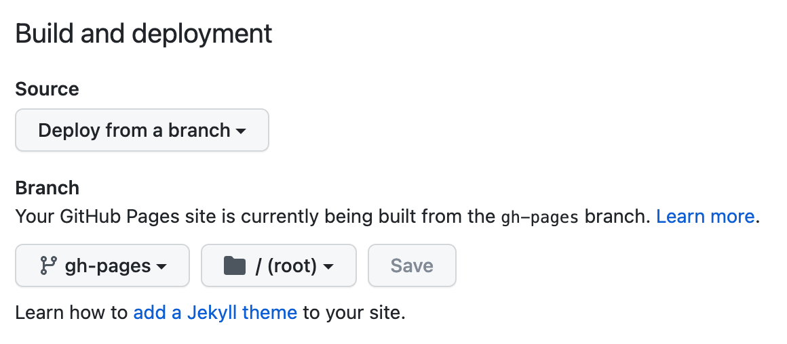

# Static timeline generator

This project is baded on https://github.com/molly/static-timeline-generator.

## Deploy

Once you run `npm run-script build`, you will see a `_site` directory containing static HTML/CSS/JS files with your site content. You can now use any static site hosting to deploy these files!

### GitHub pages

To deploy your static site on GitHub pages (free), create a branch containing the static files in the root directory by running `git subtree push --prefix _site origin gh-pages`. Then you can go to your repository's Settings > Pages options and choose "Deploy from a branch", then select `gh-pages` as the branch.

## Under the hood

This project uses

- [11ty](https://www.11ty.dev)
- [EJS](https://ejs.co/)
- [moment.js](https://momentjs.com/)
- [FontAwesome](https://fontawesome.com/)
- [normalize.css](https://github.com/necolas/normalize.css)
- [classlist-polyfill](https://github.com/eligrey/classList.js)